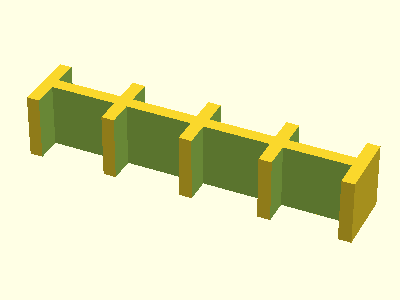

### Parts

#### Aluminum extrusion stacking
<table>
  <tr>
    <td align="center">
      <a href="ae-stacking-layer.stl">
        
         
        ae-stacking-layer
      </a>
    </td>
    <td align="center">
      <a href="ae-stacking-base.stl">
        
         
        ae-stacking-base
      </a>
    </td>
  </tr>
</table>

#### Aluminum extrusion connecting
<table>
  <tr>
    <td align="center">
      <a href="ae-plate-2hole.stl">
        
         
        ae-plate-2hole
      </a>
    </td>
    <td align="center">
      <a href="ae-plate-3hole.stl">
        
         
        ae-plate-3hole
      </a>
    </td>
  </tr>
</table>

### [LICENSE: CC BY](LICENSE.txt)
